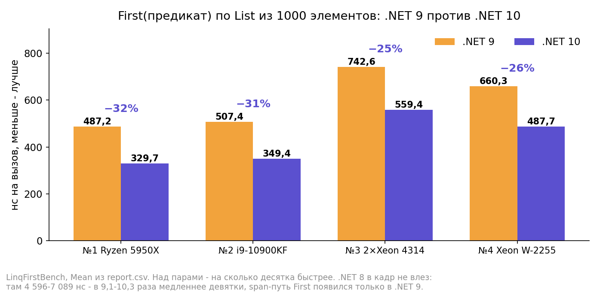
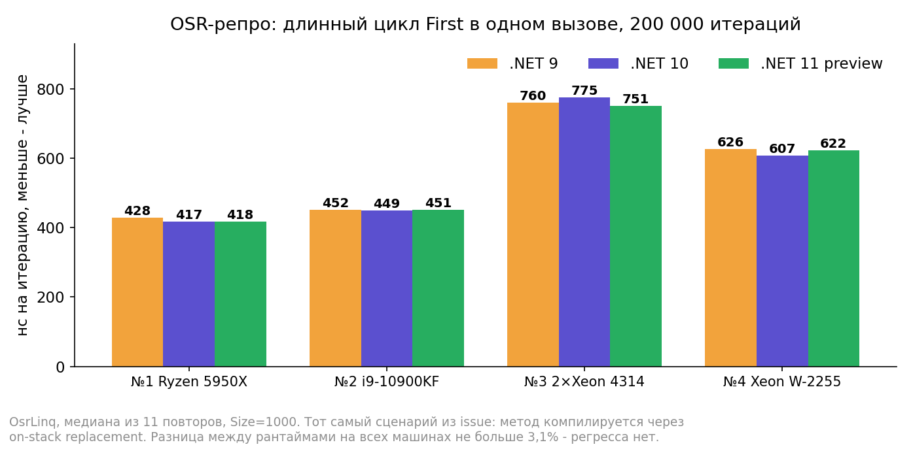
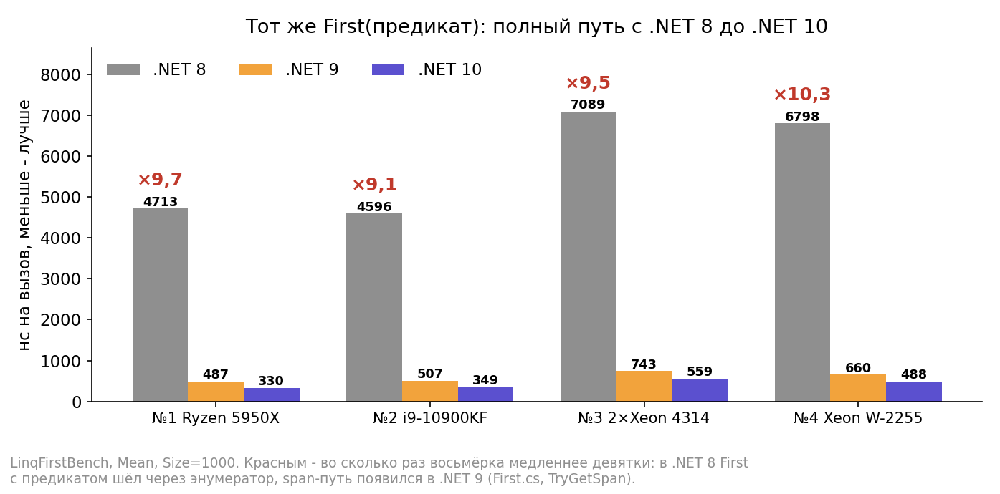
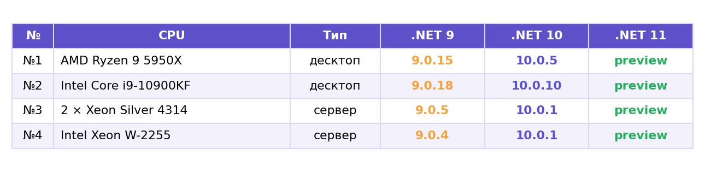

# LinqFirstProof

Проверка нашумевшего регресса LINQ в .NET 10: по issue [#117717](https://github.com/dotnet/runtime/issues/117717) First(предикат) просел к .NET 9 — у автора issue на Intel 13-го поколения до 19%, у Энди Эйерса из JIT-команды на Zen 4 порядка 10%. Причина по разбору команды — связка PGO и инлайнинга: делегат предиката перестал инлайниться. Фикс перенесён в .NET 11 (частичный — [PR #117816](https://github.com/dotnet/runtime/pull/117816), после него issue переоткрыт как [#119425](https://github.com/dotnet/runtime/issues/119425)).

Итог проверки на четырёх машинах: регресс не воспроизводится. В обычном горячем вызове .NET 10 быстрее девятки на 25–32%, в OSR-сценарии из issue — разница в пределах 3,1%, .NET 11 preview идёт наравне. Подробности и дизасм — в посте.

Пост на Хабре: ссылка появится после публикации.

## Что проверяется

- **Главный кейс**: `FirstLinq` — First с лямбдой-замыканием по List из объектов, дистиллят сценария из issue.
- **Отделение причин**: `FirstLinqCached` — делегат без захвата; если бы регресс был и тут, дело не в display class.
- **База**: `FirstFor` / `FirstForeach` — свои циклы по тому же List.
- **Генерализация делегатного пути**: `CountLinq` / `CountFor` — полный проход гарантирован семантикой.
- **Контроль**: `SumControl` — span-путь из [статьи про Sum](https://habr.com/ru/articles/1060470/), регресс его не касается.
- **OSR-репро**: `OsrLinq` / `OsrFor` — длинный цикл внутри одного вызова, метод компилируется через on-stack replacement: Эйерс прямо писал, что регресс завязан на OSR. Снятие обычным tiering'ом эффект не ловит.

Честность замера: искомый элемент лежит последним и его пара значений уникальна — First обязан пройти весь список; данные случайные с фиксированным seed; GlobalSetup сверяет ответы всех методов и падает при расхождении.

## Графики из поста









## Пруфы

- Issue [#117717](https://github.com/dotnet/runtime/issues/117717) — регресс и разбор AndyAyersMS с профилями; там же его слова про OSR и про то, что большинство приложений это не затронет.
- [PR #117816](https://github.com/dotnet/runtime/pull/117816) — частичный фикс; issue переоткрыт как [#119425](https://github.com/dotnet/runtime/issues/119425).
- Ускорение First(предикат) с .NET 8 на .NET 9 в 9,1–10,3 раза — это span-путь: в [First.cs .NET 8](https://github.com/dotnet/runtime/blob/release/8.0/src/libraries/System.Linq/src/System/Linq/First.cs) TryGetFirst идёт foreach'ем по энумератору, в [First.cs .NET 9](https://github.com/dotnet/runtime/blob/release/9.0/src/libraries/System.Linq/src/System/Linq/First.cs) — через TryGetSpan.
- Инлайн предиката виден в листингах: в Tier1-версии TryGetFirst сравнения полей с целью поиска стоят прямо в теле (0xF4243 = 1 000 003), вызов Invoke — только в запасной ветке. Так на .NET 9, 10 и 11 — `Disasm/Listings_Comp_1..4`.

## Как воспроизвести

```
dotnet run -c Release -f net10.0     # BDN: .NET 8/9/10, baseline - девятка
Disasm\bench_all.bat                 # ручной харнесс на всех четырёх рантаймах, ради .NET 11
Disasm\snap_osr.bat                  # OSR-сценарий: замер + дизасм одним запуском
Disasm\snap_pgo.bat                  # дизасм обычного пути с живым PGO
```

Дизасм только с живым tiered/PGO: с TieredCompilation=0 механизм регресса исчезает. В файлах метод печатается несколько раз — смотреть последний листинг, «Tier1 with Dynamic PGO».

## Файлы

- `Subjects.cs` — все методы, имена совпадают с постом один в один.
- `Benchmarks/LinqFirstBench.cs` — BDN-набор, .NET 8/9/10.
- `Disasm/` — паспорт железа, ручной харнесс (режим bench), OSR-режим (режим osr), скрипты снятия; готовые листинги четырёх машин в `Listings_Comp_1..4`.
- `Results/Comp_1..4/` — BDN-прогоны; в `Harness/` — bench_net8..11.txt и osr_net8..11.txt. Машины: №1 Ryzen 9 5950X, №2 i9-10900KF, №3 — 2 × Xeon Silver 4314, №4 — Xeon W-2255.
- `Results/Docs/` — картинки из поста.
